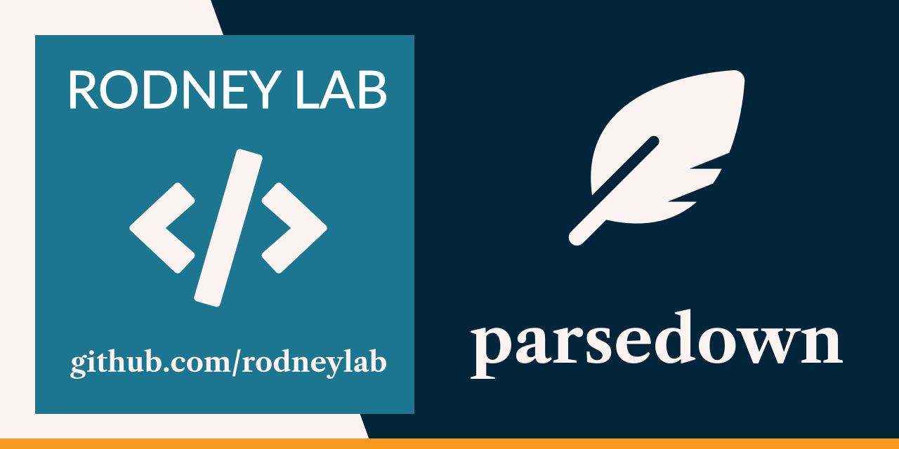

<p align="center">
  <a aria-label="Open Rodney Lab site" href="https://rodneylab.com" rel="nofollow noopener noreferrer">
    
  </a>
</p>
<h1 align="center">
  parsedown
</h1>

Light touch Markdown parsing into HTML written in Rust. Generates WASM and can be used with Deno Fresh.

- adds an id and anchor link to each h2 heading for easy linking,
- adds pretty punctuation,
- uses html5ever for HTML manipulation and pulldown-cmark for Markdown parsing.

## Compile WASM (see next section instead if working with Deno)

1. Clone the project and change into the project directory. Then run these commands

```shell
cargo install wasm-pack # skip if you already have it installed
wasm-pack build --target web
```

1. Copy the generated `pkg` folder into your JavaScript or TypeScript project.

1. Import the code into the source file you want to use it in:

```typescript
import init, {
  markdown_to_html,
  markdown_to_plaintext,
  mjml_to_html,
} from "pkg/parsedown.js";

await init();

// alternative if top level await is not available
(async () => {
  await init();
})();
```

```typescript
  const { errors, headings, html, statistics } = await markdown_to_html(
    `
## 👋🏽 Hello You

* alpha
* beta
`,
    {}
  );

/*
errors: "undefined"

headings: [{
  heading: "👋🏽 Hello You",
    id: "wave-skin-tone-4-hello-you",
}]

html: `<h2 id="wave-skin-tone-4-hello-you">👋🏽 Hello You <a href="#wave-skin-tone-4-hello-you" class="heading-anchor">#</a></h2>
<ul>
<li>alpha</li>
<li>beta</li>
</ul>
`

statistics: {
  reading_time: 1, // minutes
  word_count: 4
}
*/
```
## Compile WASM in Deno project
WIP

## 🗺️ Roadmap

- add word count and text readability statistics
